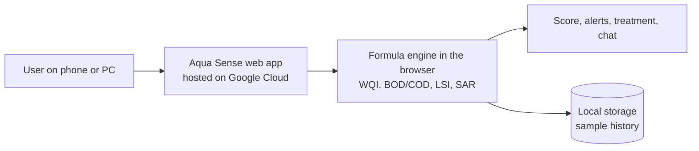

# Aqua Sense

Water quality testing for communities. Type in your readings and Aqua Sense tells you if the water is safe, what is wrong with it, and how to treat it. It runs fully in the browser, so it works even with no internet.

Track: **Sustainability** (Code for Communities Hackathon, Build with AI India)

Live demo: **PASTE YOUR LIVE LINK HERE**

Made by **Roahit**

---

## The problem

A lot of villages, schools and small farms in India do not know if their water is safe. Lab testing is far away and costs money, and the results can take days. By the time someone finds out, people may have already been drinking it.

## What Aqua Sense does

You enter readings from test strips or meters (TDS, pH, turbidity, temperature and more, up to 45 inputs). The app then gives you:

- A water quality score and a clear safe / moderate / unsafe result
- Risk alerts for anything above the WHO limits
- Estimated BOD and COD when you do not have lab values
- Scaling and corrosion risk, and irrigation suitability (SAR)
- Treatment suggestions based on your own values
- A chat assistant that answers water questions offline (1000+ topics)
- A history page to save and compare samples
- Light and dark mode

## How it works

The analysis uses formulas, not a black box. That means every result can be traced back to a number.

- Water quality score uses a WHO weighted index
- BOD and COD estimates were tuned using CPCB 2019 data from six Indian rivers
- Scaling and corrosion use a Langelier style saturation check
- Irrigation suitability uses SAR

Everything runs in the browser with plain HTML, CSS and JavaScript (Chart.js for the charts). Samples are saved in the browser's local storage on your own device. No account, no server, no API keys.

I tested it with a water sample from the Vaigai River in Tamil Nadu.

## Architecture

The app is one static page hosted on Google Cloud (Firebase Hosting). All calculations happen on the user's device, so it keeps working with no internet and no data is sent anywhere.

## Run it yourself

1. Download or clone this repo
2. Open `index.html` in any browser

That is it. No install and no setup. To host it, upload `index.html` to Firebase Hosting or any static host.

## Project files

- `index.html` is the whole app
- `README.md` is this file
- `LICENSE` is the license

## What I want to add next

- A phone app that scans test strips with the camera
- One handheld probe that puts all the sensors in one device
- More local languages like Tamil and Hindi
- Real lab and CPCB station data to test the formulas more

## Limits

Aqua Sense is a first check, not a replacement for a certified lab. The BOD and COD numbers are estimates when lab values are not entered, and they were tuned on a small number of river samples. If the result says unsafe, get the water tested properly.

## Research

A research paper on this project has been submitted to a journal and is under review.

---

Copyright (c) 2026 Roahit
